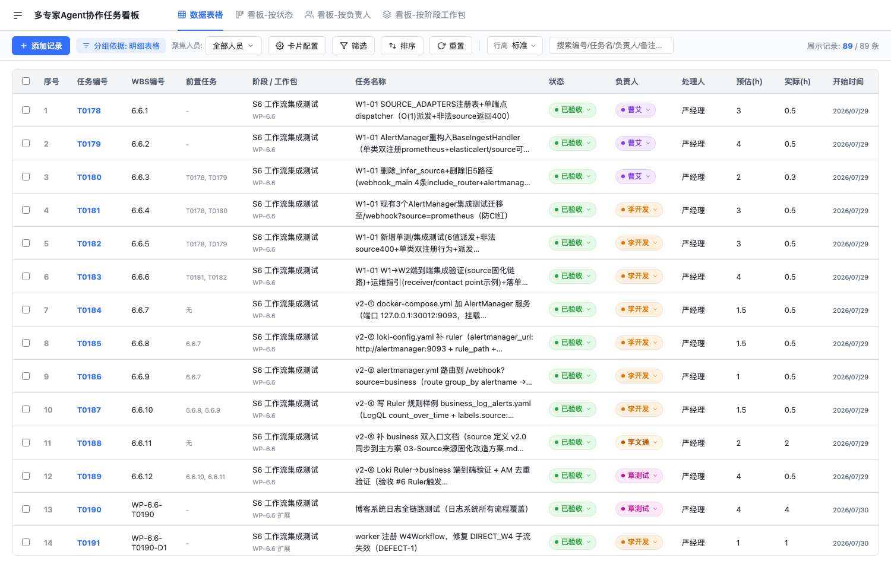
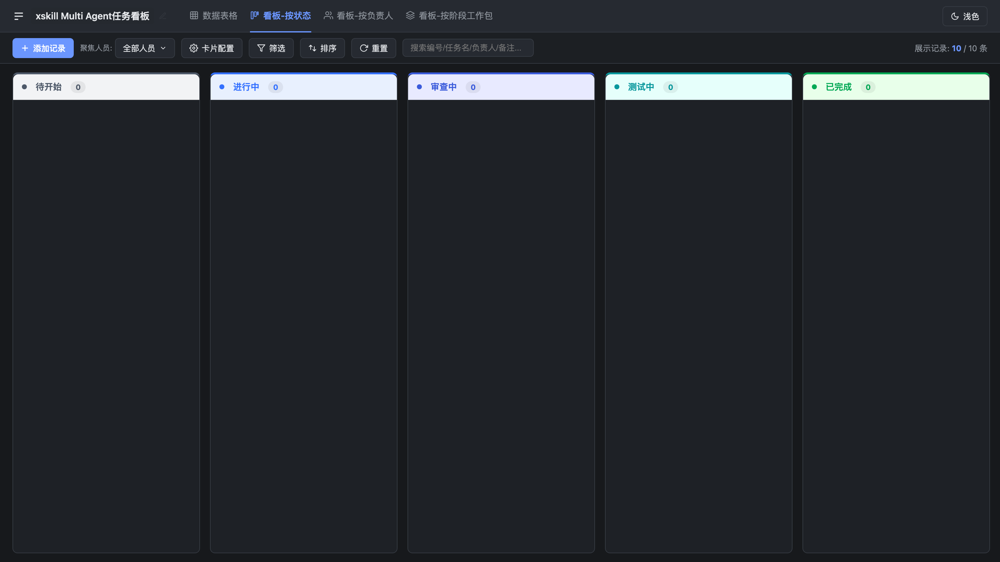
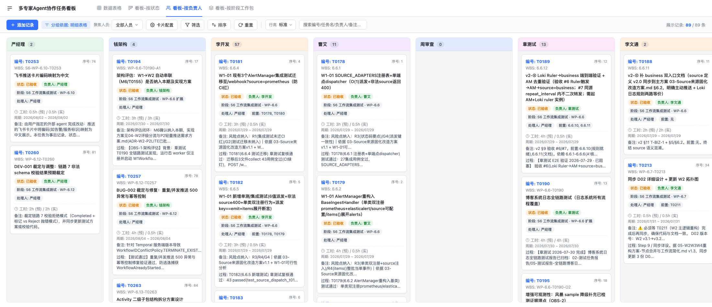
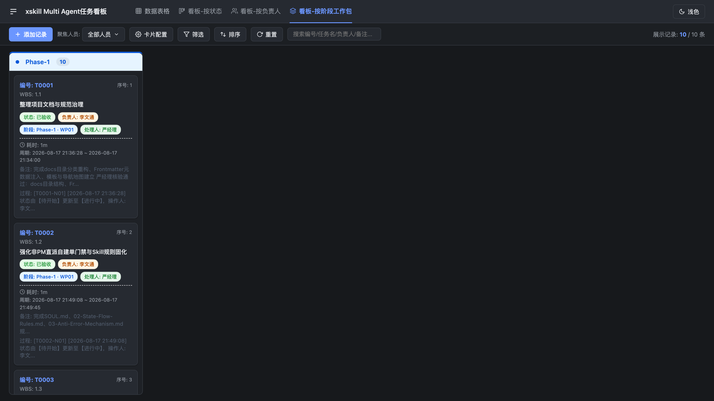

# 多专家Agent协作任务看板

一个**零依赖、离线可用**的任务看板应用，专门用于管理「多专家 Agent 协作」模式下的项目任务流转与验收记录。

## 项目用途

在 AI Agent 协作开发项目中，任务需要经历 **规划 → 开发 → 审查 → 测试 → 验收** 的完整流转，并由不同角色的专家（经理、架构、开发、审查、测试等）接力处理。本项目用一个纯前端页面承载这套流程：

- **完整记录协作史**：每个任务的状态流转、打回原因、缺陷修复闭环、验收结论全部沉淀在卡片中，可随时复盘
- **多视角查看**：同一份数据提供表格与三种看板视图，按状态 / 按负责人 / 按阶段工作包自由切换
- **零成本使用**：无服务器、无构建、无第三方依赖，双击 HTML 即可用，数据存本地
- **局域网分享**：一条命令启动静态服务，同网段设备浏览器直接访问

## 快速开始

**本机使用**：直接用浏览器打开 `offline_board.html`。

**局域网分享**：

```bash
./start.sh            # 默认端口 28888
./start.sh 9000       # 自定义端口
```

- 本机访问：`http://127.0.0.1:28888/offline_board.html`
- 局域网访问：`http://<本机IP>:28888/offline_board.html`（查 IP：`ipconfig getifaddr en0`）
- 停止：Ctrl+C；Mac 重启后重新执行 `./start.sh`
- 其他设备打不开时，检查 macOS 防火墙是否放行 Python

## 界面预览

**数据表格视图** —— 89 条任务明细，支持筛选、排序、搜索、批量操作：



**看板-按状态视图** —— 任务按 9 种状态分组，支持跨列拖拽流转：



**看板-按负责人视图** —— 按专家角色查看各自任务负载：



**看板-按阶段工作包视图** —— 按 7 个阶段工作包查看任务分布：



## 核心功能

| 功能 | 说明 |
|---|---|
| 四种视图 | 数据表格 / 看板-按状态 / 看板-按负责人 / 看板-按阶段工作包 |
| 看板拖拽 | 卡片跨列拖拽修改状态或负责人，触发流转说明录入并即时保存 |
| 详情双模式 | 支持「只读模式」（卡片头+属性网格+时间轴日志）与「编辑模式」自由切换 |
| 状态流转审计 | 状态变更时弹出 `transition-modal` 记录变更原因与过程说明，写入审计轴 |
| 时间轴与缺陷追踪 | 智能聚合多维日志，自动解析时间戳并高亮标注 `DEF-` 缺陷/阻塞/打回记录 |
| 多维筛选 | 状态、负责人、人员多选聚焦、关键词搜索，可组合使用 |
| 排序与布局 | 按任意字段排序、行高 4 档调节、表格列宽自由拖拽 |
| 记录管理 | 添加记录、只读/编辑切换、自定义统一 UI 确认删除对话框 |
| 批量删除 | 表格多选后批量删除 |
| 卡片配置 | 看板卡片显示字段自定义开关 |
| 数据持久化 | 自动读取 `board.json` / `json/kanban_meta.json` 配置，改动实时同步浏览器 localStorage |
| 主题切换 | 日出日落自动主题 + 浅色/深色手动切换 |
| 一键重置 | 恢复内置示例数据 |

## 数据与配置说明

- **配置文件支持**：
  - `board.json`: 存储根目录看板卡片初始数据。
  - `json/kanban_meta.json`: 系统配置（人员、状态、字段定义、阶段与工作包）。
- **缓存与持久化**：
  - 改动自动持久化在浏览器 localStorage（key: `offline_board_cards_v3`）。
  - 点击工具栏「重置」可丢弃本地改动、恢复初始数据。
- ⚠️ 局域网访问时**每台设备各自维护一份数据，互不同步**；如需多人共享同一份数据，需引入后端存储。

## 项目结构

```
├── offline_board.html     # 主入口页面
├── board.json             # 看板卡片初始数据
├── css/styles.css         # 主看板样式
├── js/                    # 模块化脚本（app/data/board/listbox/util）
├── json/kanban_meta.json  # 人员/状态/字段/阶段配置
├── kanban-skeleton/       # 从 skill 提取的看板设计骨架（参考资产）
├── screenshots/           # 界面预览截图
└── start.sh               # 局域网分享启动脚本
```
